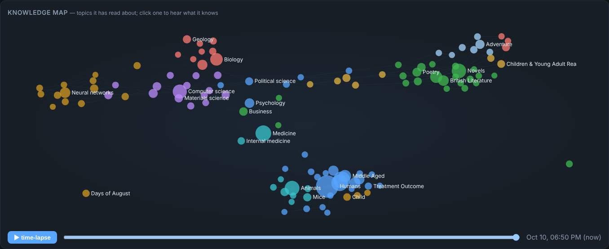
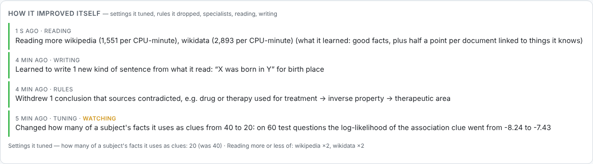

# Polymath

An autonomous learning agent for the Raspberry Pi 5 that teaches itself from public data, around the clock,
and answers questions about what it has learned — **without** an LLM, external AI services or pretrained
models. Every intelligent part (tokenizer, stemmer, sentence splitter, phrase finder, entity linker, relation
extractor, word embeddings, vector index, truth discovery, rule learning, curiosity, self-evaluation) is
implemented here and learns only from data the agent downloads itself.

- **Runtime dependencies:** Python 3.11+ standard library and **numpy**. That is all (a test enforces it).
- **Data:** Wikipedia, Wikidata, OpenAlex, PubMed, Project Gutenberg, Stack Exchange dumps, RSS/Atom feeds and
  a polite crawler (robots.txt, ≤ 1 request/s per host). See [docs/SOURCES.md](docs/SOURCES.md).
- **Grows onto any drive you plug in:** a USB SSD, HDD or stick becomes extra brain space automatically. A blank
  drive, or a new SSD straight from the shop (exFAT/NTFS with only the maker's software on it), is formatted
  for Linux and the whole brain moves onto it. It is formatted **once per drive, ever**: unplugging, a power
  cut or a replug never formats it again. On a drive with your files, only free space is used and the files
  are never touched. It can start on the SD card (`--allow-sd-card`).
- **Learns from the open web, safely:** new sites come only from links Wikipedia cites, and each is checked
  before its first visit: offline safety lists (adult, malware, phishing, gambling), a valid HTTPS
  certificate, robots.txt. Then it stays on probation until its facts check out.
- **Learns from its mistakes:** every wrong self-test answer is read up on and re-tested.
- **Tells you what it learned:** a daily digest in the feed, the dashboard, and `polymath digest`, and every
  Sunday a recap of the week against the week before (`polymath recap`).
- **Tells you about anything it knows:** `polymath tell "Marie Curie"` writes a short encyclopedia-style
  paragraph from its facts ("Curie was born in Warsaw on 7 November 1867 …") with numbered sources.
- **Predicts facts before it reads them:** it guesses missing facts, checks the guesses when the facts arrive,
  and keeps score against chance (`polymath predictions`). On earlier real data it got 25 of 27 hidden facts
  right, where guessing would score 23 %.
- **Did you know?** It flags facts that surprised its own model, such as the largest or smallest of their kind,
  or a different answer from what everything else it knew pointed to.
- **Knowledge map:** an interactive star map of what it has read about on the dashboard, with a time-lapse of
  its brain growing. Click a topic and it tells you what it knows.
- **Watch from your phone:** `http://<pi>:8765/live` shows the face and the live feed.
- **Protects the SD card:** it measures how much it writes and estimates how long the card lasts at that rate.
  It writes less (idle cycles now write nothing), and when you plug in a drive, the whole brain moves onto it.
- **Watch it learn:** at login a terminal opens with a live feed of everything it reads, learns, infers,
  tests itself on and gets rewarded for. A little animated face at the top shows its mood (reading, thinking,
  proud of a fixed mistake, wide-eyed at a new drive, looking around when one is unplugged, dozing when idle), and the top right shows the exact version it runs, with ✓ when
  the agent runs the installed update.
- **Keeps the Pi healthy:** at most 2 cores and 3 GB, `nice 10`, so the desktop stays responsive. It throttles
  at 75 °C and pauses at 82 °C.
- **Survives power loss:** every step commits atomically (SQLite WAL); jobs resume where they stopped.
- **Improves itself from what it learns** (never by editing its code):
  - it tunes its own settings with fair A/B tests and undoes a change if its self-test score drops;
  - it drops rules whose conclusions sources keep contradicting;
  - it spawns specialist agents for its weak spots;
  - it reads more of what teaches it most and learns how to phrase sentences from what it reads.

  Every change is logged with its numbers: `polymath changes`, the dashboard, the feed.
- **Reasons, not just looks up** (v0.5), every answer with its sources:
  - multi-step questions: "Who is the head of government of the capital of France?";
  - numbers and units: "Is Mount Everest taller than K2?" (feet and metres compared properly), "How many times
    bigger is Brazil than Portugal?", population density;
  - places: distances, "Which is further north?", "What is near the Eiffel Tower?";
  - time: facts with dates (Germany's capital was Bonn *until 1990*), ages, "Which came first?", who lived at the
    same time, what happened in a year;
  - why: what causes something and what it leads to; kinds of things and what they can do, with exceptions ("Can
    penguins fly?"); how-to steps from Stack Exchange.

  It also catches facts that cannot be true (died before being born, a city bigger than its country, numbers far
  outside their normal range), merges duplicate entries, reads Wikipedia's data tables, cross-checks a second
  Wikipedia language, and switches to big-brain mode on a large drive.
- **Answers offline**, with citations and confidences, and says "I don't know yet" instead of guessing.






## Install (Raspberry Pi OS Bookworm, 64-bit)

Best with an NVMe drive mounted at `/srv/polymath` ([docs/OPERATIONS.md](docs/OPERATIONS.md#nvme)). No drive
yet? Use `sudo ./install.sh --allow-sd-card`, then plug drives in later; they are added by themselves. Then:

```bash
git clone --branch claude/polymath-agent https://github.com/Blazeffect83/Blazeffect83.git
cd Blazeffect83/polymath
sudo ./install.sh
```

That's it. The agent and dashboard start now and at every boot. The desktop logs in automatically and opens
a terminal with the **live feed**. The browser dashboard (charts, topics, agents, ask box) is in the menu, and
on any device on your network at `http://<pi-address>:8765/`.

## Use

```bash
polymath feed                                    # the live feed (what the terminal at login shows)
polymath ask "What is the capital of France?"   # offline, with sources
polymath ask "Is Brazil bigger than Angola?"     # comparisons, distances, ages, causes, kinds, how-to, chains
polymath learn "black holes"                     # research a topic as a priority (or give a URL)
polymath topics --weakest                        # where its knowledge is thinnest
polymath why "Black holes"                       # why it is (or is not) working on something
polymath status                                  # health, queue, knowledge counts
polymath version                                 # installed version and commit; is the agent running it?
polymath storage list                            # the drives in its brain
polymath digest                                  # what it learned today
polymath recap                                   # the week in review (this week against last week)
polymath tell "Marie Curie"                      # a paragraph written from what it learned, with sources
polymath predictions                             # facts it guessed before reading them, and how many came true
polymath wear                                    # disk writes per day; how long the SD card lasts at this rate
polymath sites                                   # new sites it vetted, refused or dropped, and why
polymath changes                                 # what it changed about itself, and why (--reset NAME to overrule)
```

### Agents with their own directives

Spawn as many specialised agents as you like. Each one learns on its own and earns rewards **only when its work is
verified correct**: against hidden facts, against facts that arrive later in the dumps, or against your verdict.
Rewards add up to XP and levels. Agents that do well get more of the CPU and fork mutated children that compete
with them. A child that does better passes its traits back to your agent.

```bash
polymath agents spawn "research black holes"          # also: "watch news about SpaceX", "fact-check populations",
polymath agents spawn "predict the country of cities" #       "answer questions about chemistry", …
polymath agents task research-black-holes "What is a quasar?"
polymath agents feedback 42 correct                   # your verdict is a reward (or a penalty)
polymath agents list                                  # levels, XP, right / wrong, status
polymath agents show research-black-holes             # what it learned to prefer, recent tasks
```

`polymath --help` lists the rest (`report`, `backup`, `restore`, `sources`, `sample`, …).

## Documentation

| | |
|---|---|
| [ARCHITECTURE](docs/ARCHITECTURE.md) | the loop, the database, how the parts fit together |
| [ALGORITHMS](docs/ALGORITHMS.md) | every learning algorithm, from scratch, and why |
| [SOURCES](docs/SOURCES.md) | where knowledge comes from, licenses, politeness |
| [OPERATIONS](docs/OPERATIONS.md) | install, NVMe, logs, backups, restore, tuning, uninstall |
| [VERIFICATION](docs/VERIFICATION.md) | what was measured, where, and what is still pending |

## Develop

```bash
python3 -m venv .venv && .venv/bin/pip install -e '.[dev]'
.venv/bin/pytest --cov=polymath && .venv/bin/ruff check . && .venv/bin/mypy polymath scripts
.venv/bin/python scripts/benchmark.py            # measures every subsystem on this machine
```
