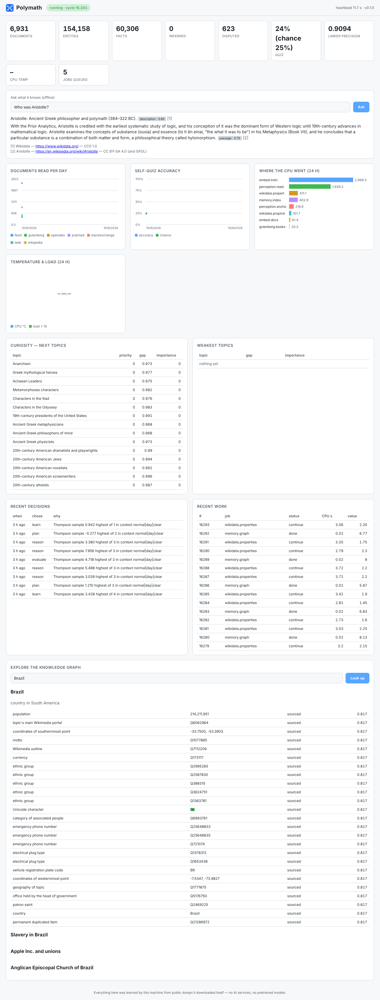

# Polymath

An autonomous learning agent for the Raspberry Pi 5 that teaches itself from public data, around the clock,
and answers questions about what it has learned — **without** an LLM, external AI services or pretrained
models. Every intelligent part (tokenizer, stemmer, sentence splitter, phrase finder, entity linker, relation
extractor, word embeddings, vector index, truth discovery, rule learning, curiosity, self-evaluation) is
implemented here and learns only from data the agent downloads itself.

- **Runtime dependencies:** Python 3.11+ standard library and **numpy**. That is all (a test enforces it).
- **Data:** Wikipedia, Wikidata, OpenAlex, PubMed, Project Gutenberg, Stack Exchange dumps, RSS/Atom feeds and
  a polite crawler (robots.txt, ≤ 1 request/s per host). See [docs/SOURCES.md](docs/SOURCES.md).
- **Shares the Pi:** at most 2 cores and 3 GB, `nice 10`, and it yields whenever someone is playing on the
  Minecraft server. It throttles at 75 °C and pauses at 82 °C.
- **Survives power loss:** every step commits atomically (SQLite WAL); jobs resume where they stopped.
- **Answers offline**, with citations and confidences, and says "I don't know yet" instead of guessing.



## Install (Raspberry Pi OS Bookworm, 64-bit)

You need an NVMe drive mounted at `/srv/polymath` (Polymath refuses to put bulk data on the SD card;
[docs/OPERATIONS.md](docs/OPERATIONS.md#nvme) shows how to mount it). Then:

```bash
git clone --branch claude/polymath-agent https://github.com/Blazeffect83/Blazeffect83.git
cd Blazeffect83/polymath
sudo ./install.sh
```

That's it. The agent and dashboard start now and at every boot. The desktop logs in automatically and opens
the dashboard full-screen. You can also open it from any device on your network: `http://<pi-address>:8765/`.

## Use

```bash
polymath ask "What is the capital of France?"   # offline, with sources
polymath learn "black holes"                     # research a topic as a priority (or give a URL)
polymath topics --weakest                        # where its knowledge is thinnest
polymath why "Black holes"                       # why it is (or is not) working on something
polymath status                                  # health, queue, knowledge counts
```

### Agents with their own directives

Spawn as many specialised agents as you like. Each one learns on its own and earns rewards **only when its work is
verified correct**: against hidden facts, against facts that arrive later in the dumps, or against your verdict.
Rewards add up to XP and levels. Agents that do well get more of the CPU and fork mutated children that compete
with them. A child that does better passes its traits back to your agent.

```bash
polymath agents spawn "research black holes"          # also: "watch news about SpaceX", "fact-check populations",
polymath agents spawn "predict the country of cities" #       "answer questions about chemistry", …
polymath agents task research-black-holes "What is a quasar?"
polymath agents feedback 42 correct                   # your verdict is a reward (or a penalty)
polymath agents list                                  # levels, XP, right / wrong, status
polymath agents show research-black-holes             # what it learned to prefer, recent tasks
```

`polymath --help` lists the rest (`report`, `backup`, `restore`, `sources`, `sample`, …).

## Documentation

| | |
|---|---|
| [ARCHITECTURE](docs/ARCHITECTURE.md) | the loop, the database, how the parts fit together |
| [ALGORITHMS](docs/ALGORITHMS.md) | every learning algorithm, from scratch, and why |
| [SOURCES](docs/SOURCES.md) | where knowledge comes from, licenses, politeness |
| [OPERATIONS](docs/OPERATIONS.md) | install, NVMe, logs, backups, restore, tuning, uninstall |
| [VERIFICATION](docs/VERIFICATION.md) | what was measured, where, and what is still pending |

## Develop

```bash
python3 -m venv .venv && .venv/bin/pip install -e '.[dev]'
.venv/bin/pytest --cov=polymath && .venv/bin/ruff check . && .venv/bin/mypy polymath scripts
.venv/bin/python scripts/benchmark.py            # measures every subsystem on this machine
```
