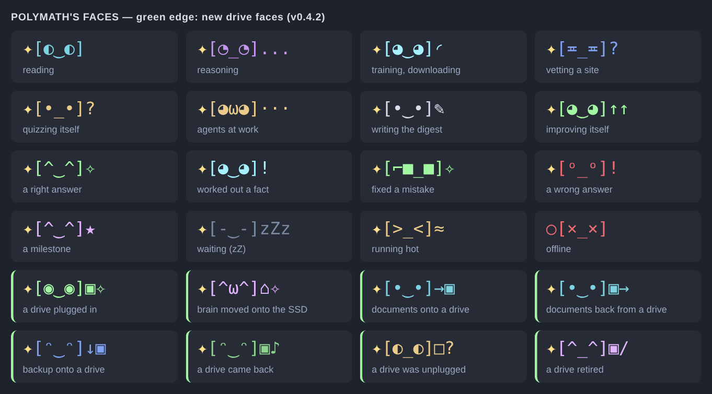

# Operations

## <a id="nvme"></a>1. Prepare the NVMe drive (once), or start on the SD card

Polymath prefers to keep its data off the SD card: a filesystem mounted at `/srv/polymath`.

**No drive yet?** `sudo ./install.sh --allow-sd-card` keeps the brain on the SD card for now:
- the budget is sized to the card (at most 15 GB, leaving 10 GB free);
- any drive you plug in later is added to the brain automatically (§8).

Constant database writes wear SD cards, so add a USB SSD when you can.

> **Warning:** `mkfs` erases the drive. Check the device name with `lsblk` first.

```bash
lsblk                                         # find the NVMe disk, e.g. /dev/nvme0n1
sudo mkfs.ext4 -L polymath /dev/nvme0n1p1     # ERASES the partition — only on an empty drive
sudo mkdir -p /srv/polymath
echo 'LABEL=polymath /srv/polymath ext4 defaults,noatime 0 2' | sudo tee -a /etc/fstab
sudo mount -a && findmnt /srv/polymath
```

If the drive already has a filesystem you want to keep, mount that one instead. A bind mount of a directory
on the NVMe drive also works.

## 2. Install, upgrade, uninstall

```bash
sudo ./install.sh              # first install and every upgrade (idempotent: safe to repeat)
sudo ./install.sh --allow-sd-card   # no NVMe yet: keep the brain on the SD card, add drives later
sudo ./install.sh --dry-run    # show what it would do
sudo ./uninstall.sh            # remove services and code; KEEPS /srv/polymath and /etc/polymath
sudo ./uninstall.sh --purge --yes   # also delete everything it learned, and its user
```

`install.sh` does the following:
- checks the mount;
- creates the `polymath` system user;
- installs `python3-venv`, `curl`, `fdisk` and `e2fsprogs` if missing;
- copies the code to `/opt/polymath/src` and builds `/opt/polymath/venv` (numpy only);
- records the build (version, git commit, commit date) in `/opt/polymath/build.json`. A new commit restarts the
  agent so that it runs, and reports, the installed build;
- writes `/etc/polymath/polymath.toml` (never overwritten once it exists);
- installs `polymath.service`, `polymath-dashboard.service` and a journald size limit;
- enables desktop autologin (`raspi-config nonint do_boot_behaviour B4`);
- adds the live feed terminal to the desktop user's autostart (XDG, labwc and wayfire), plus menu entries for the
  live feed and the dashboard. An upgrade replaces the dashboard autostart of earlier versions;
- installs the storage pool: a udev rule, `polymath-volume@.service` and `/mnt/polymath`, then adopts drives that
  are already plugged in (§8);
- comments out the `minecraft_*` settings of earlier versions in an existing configuration (backup:
  `polymath.toml.bak`). Left in place, they would be ignored with a warning;
- starts everything and waits for `/health`.

## 3. Everyday

| | |
|---|---|
| live feed | opens in a terminal at login · `polymath feed` in any terminal · menu: *Polymath live feed* |
| dashboard | `http://<pi>:8765/` · menu: *Polymath dashboard* |
| status | `polymath status` · `systemctl status polymath polymath-dashboard` |
| logs | `journalctl -u polymath -f` (JSON lines; `-o cat` for compact) |
| nightly report | `/srv/polymath/reports/report-YYYY-MM-DD.md` or `polymath report` |
| research a topic | `polymath learn "topic"` or `polymath learn https://example.org/` |
| what it learned today | `polymath digest` (written daily at 07:00; also in the feed and on the dashboard) |
| new sites it vetted | `polymath sites` · `polymath sites --check example.org` |
| the week in review | `polymath recap` (Sundays at 08:00; `--now` for this week so far) |
| tell me about … | `polymath tell "topic"`, or ask "Tell me about …" on the dashboard |
| its predictions | `polymath predictions` (guessed before reading; confirmed, wrong, open) |
| SD card wear | `polymath wear` |
| on your phone | `http://<pi>:8765/live`: the face and the live feed |
| knowledge map | on the dashboard: topics clustered by what they share, sized by documents. ▶ plays the time-lapse; click a topic to ask about it |
| what it changed about itself | `polymath changes` (`--all` adds trials that changed nothing; `--json`), the dashboard panel *How it improved itself*, "improved" lines in the feed |
| overrule a tuned setting | `polymath changes --reset NAME` (or `all`): back to the default and pinned · `polymath changes --allow NAME` (or `all`) lets it tune again |

### How it improves itself

It never edits its code. What it changes, each change logged with the numbers behind it:

- **Settings**: every 8 hours it tests one setting against half/double (or a grid of) alternatives on the same
  questions and adopts a clearly better value. A new value is *watching* until two self-tests have run; if
  accuracy falls by more than 5 points it is undone by itself. Settings: `link.subjects`, `link.features`,
  `predict.min_confidence`, `infer.min_confidence`.
- **Rules**: every 6 hours each learned rule is checked against what sources later said. Rules that keep
  being contradicted are dropped with the facts only they produced; contradicted conclusions are withdrawn and
  never re-derived.
- **Specialists**: a relation it keeps getting wrong on the self-test (for example "fix birth place") gets its
  own *predict* agent (`polymath agents list` shows them, marked auto). They retire when the relation recovers,
  or after 21 days.
- **Reading**: daily it reads more of the sources and topics that teach it the most per CPU-minute (weights
  0.5–2, shown on the dashboard).
- **Writing**: it learns sentence phrasings from what it reads ("X was born in Y") and `tell` uses them.

The CLI reads the same configuration as the service (`/etc/polymath/polymath.toml`). `install.sh` puts
`polymath` on everyone's PATH (`/usr/local/bin/polymath`):
- most commands run as the `polymath` user, which owns the data, through `sudo`;
- `polymath feed` runs as you;
- `storage attach|detach|eject` run as root.

### The live feed

`polymath feed` shows what the agent is learning, as it happens:

| tag | what |
|---|---|
| `read` | a document arrived: Wikipedia article, paper, book, feed item, crawled page |
| `fact` / `disputed` | a fact it learned (from Wikidata, an infobox, or read in a sentence, quoted); disputed when sources disagree |
| `inferred` | a fact it derived with a learned rule (inverse, transitive, symmetric) |
| `reason` | rules learned (with examples), facts inferred, contradictions checked, how much it trusts each source |
| `quiz` | a self-test on a hidden fact: ✓ / ✗ with the truth, then the score against chance |
| `agent` | an agent's verified reward or penalty and what it was for; new and evolved agents |
| `curious` | the topics it most wants to learn about now |
| `you` | what you asked it to learn |
| `body` | throttling, pausing, back to normal, agent offline/online |
| `site` / `safety` | a new site approved, put on probation, refused (and why), or dropped; a safety list loaded |
| `relearn` / `fixed ✓` | reading up on a wrong self-test answer; getting it right on the re-test |
| `digest` | the daily "what I learned today" summary, line by line |
| `report` / `backup` / `error` | nightly report, backups, failed job slices (with retry or give-up) |

Busy streams are capped per refresh (for example 5 facts and 4 documents every 1.5 s), and the rest are counted
(`+4,312 more facts`), so a Wikidata ingest stays readable. The pinned header shows:
- the state, and the version top right;
- **a NOW line** with what it is doing right now, highlighted (cyan; yellow when paused; red when not running);
- its knowledge counts, the latest quiz score and the CPU temperature.

The feed window uses a larger font (14 pt) than other terminals. Change it with `POLYMATH_FEED_FONT_SIZE`, or
edit `~/.config/polymath-feed/lxterminal/lxterminal.conf` (your other terminals are not affected). The dashboard
and the `/live` page show the same NOW line as a large banner.

**Version, top right.** `v0.2.0 · ab12cd3 · 2026-10-10 ✓` is the installed version, git commit and commit date;
`✓` means the running agent was started from exactly that build. `↻ agent still on v0.1.0` means an update is
installed but the agent has not restarted into it yet (`install.sh` restarts it; `sudo systemctl restart
polymath` does too). After an update the feed window reloads itself into the new code within 30 seconds, with
the line `updated to v… : reloading the feed`. `polymath version` prints the same check. It compares the Pi with
itself: it does not contact GitHub to look for newer commits.

**The face, top left.** A small animated character shows what it is doing, so the window is worth a glance:



| face | when |
|---|---|
| `[◐‿◐]` ⇄ `[◑‿◑]` | reading (eyes run along the line) |
| `[◔_◔]...` | reasoning, planning, going over mistakes |
| `[◕‿◕]◜` | training its models, downloading (spinner) |
| `[≖_≖]?` | vetting a new site |
| `[•_•]?` | quizzing itself |
| `[◕ω◕]···` | agents at work |
| `[•‿•]✎` | writing the digest or the nightly report |
| `[-‿-]zZ` | waiting for work (`[˘‿˘]zZ` at night) |
| `[^‿^]✧` | a right answer, a better quiz score, a site approved, a new agent, the digest |
| `[◕‿◕]!` | worked out a new fact by reasoning |
| `[⌐■_■]` | fixed an earlier mistake |
| `[ᵒ_ᵒ]!` / `[¬_¬]?` / `[×_×]!` | a wrong answer / a contradiction or refused site / a failed job |
| `[^‿^]★` | a milestone (1, 2, 5 × 10ⁿ facts, documents or rules; also a feed line) or a new drive |
| `[>_<]` / `[-_-]` / `○[×_×]` | running hot / paused / agent offline |

The spark on its head (`✦`/`✧`) pulses while the agent is alive and it blinks every few seconds. There is no
language model and no randomness: the face is a function of the agent's state, the last few events and the clock.

The feed reads from the dashboard service (`/api/feed`, localhost), so the desktop user needs no access to
`/srv/polymath`. Options: `--plain` (no pinned header, for logs or `ssh`), `--no-color`, `--once`,
`--interval 3`, `--url http://<pi>:8765` (watch from another machine), `--direct` (read the database
directly, as a user who can). To stop the window opening at login, delete
`~/.config/autostart/polymath-feed.desktop` and the `open-feed.sh` lines in `~/.config/labwc/autostart` and
`~/.config/wayfire.ini`.

## 4. How it keeps the Pi healthy

| condition | mode | effect |
|---|---|---|
| CPU ≥ 75 °C (until < 72 °C) | throttle | light jobs only, half-length slices |
| CPU ≥ 82 °C (until < 77 °C) | pause | nothing runs |
| free disk < `disk_min_free_gb` | yield | light jobs only, half-length slices; eviction requested |
| free disk < half of that | pause | only eviction runs |
| data > `disk_budget_gb` | — | eviction requested |

These limits always apply, whatever the mode:
- `CPUQuota=200%` (2 of 4 cores), `MemoryMax=3G`, `Nice=10`, idle-ish IO priority;
- numpy is limited to 2 threads;
- the dashboard is limited to 25 % CPU and 400 MB.

**SD card wear.** An SD card wears out from writes, and nothing on it reports its own wear, so Polymath measures
writes and estimates. Every 15 minutes it records the bytes written to the data disk and the system disk
(`/sys/dev/block/…/stat`), and the agent's own share (`/proc/self/io`):
- **rated life**: `capacity × sd_endurance_cycles ÷ sd_write_amplification` (1,000 and 3 by default, which
  is conservative for consumer cards). The daily budget makes that last `sd_target_years` (5);
- **over budget**: on the data disk it switches to saver mode, with twice-as-long job slices. Each slice is
  one commit, so fewer, larger commits write less. The feed and the digest say so once a day;
- **read-only**: a data disk the kernel turned read-only (the usual sign of a failing card) pauses everything,
  with that reason in the feed;
- **lower baseline**: idle cycles no longer write a heartbeat every 2 seconds (that was about 350 MB a day),
  and a busy job slice writes 25 % less than before (measured).

`polymath wear` shows the numbers ("SD card (data disk): 3.6 GB written in the last day, budget 11.7 GB/day; at
this rate it lasts about 6.6 years"). The figure is a rate, not the card's remaining life, because writes from
before Polymath was installed are unknown. **The permanent fix is a drive** (§8): plug one in and the brain
moves onto it.

The limits leave half the CPU and a quarter of the memory to the desktop. To give the agent the whole Pi, raise
them with a drop-in (`sudo systemctl edit polymath`, for example `CPUQuota=350%` and `MemoryMax=6G` on an 8 GB
Pi).

## 5. Backups and restore

- **Nightly backups** run at 03:00 local time (`body.backup_hour`):
  - SQLite's online backup API copies the database while the agent runs;
  - `PRAGMA quick_check` verifies the copy;
  - the copy is compressed with xz and stored in `/srv/polymath/backups/`;
  - the newest 7 are kept (`body.backup_keep`);
  - a backup is skipped, and logged, if the disk could not hold it.
- **On demand:** `polymath backup` · `polymath backup --list`.
- **Restore:**

  ```bash
  sudo systemctl stop polymath polymath-dashboard
  sudo -u polymath /opt/polymath/venv/bin/polymath restore polymath-20261009-030000.sqlite3.xz
  sudo systemctl start polymath polymath-dashboard
  ```

  The restore checks the backup's integrity before swapping it in, and keeps the replaced database as
  `polymath.sqlite3.pre-restore-<time>`.

The indexes under `/srv/polymath/index` are rebuilt from the database automatically if they are lost.

## 6. Power loss and crashes

Each job slice and its bookkeeping commit in one SQLite transaction (WAL, `synchronous=NORMAL`). After a power
cut:
- the agent restarts;
- interrupted jobs are re-queued from their last checkpoint;
- a job whose process died mid-slice 3 times is dead-lettered (`polymath status` lists dead jobs), so one bad
  input cannot loop forever.

The systemd watchdog (120 s) restarts a hung agent.

## 7. Configuration

Everything is optional; see the commented `/etc/polymath/polymath.toml`. Common changes:

```toml
[senses]
contact = "you@example.org"          # recommended by Wikimedia for dump users
feeds = ["https://example.org/feed"] # replaces the built-in feed list
seeds = ["https://docs.example.org/"]
stackexchange_sites = ["ai", "physics", "math"]
wikipedia_lang = "en"

[body]
disk_budget_gb = 400
```

Apply changes with `sudo systemctl restart polymath polymath-dashboard`.

## 8. Storage pool: drives you plug in

Plug a drive in and it becomes part of the brain. No commands are needed:

1. udev starts `polymath-volume@<device>.service`, which runs `polymath storage attach` as root.
2. The helper checks the drive and mounts it at `/mnt/polymath/<filesystem UUID>`, with a `polymath-brain/`
   folder and a manifest saying how much of it Polymath may use.
3. The agent notices within 30 seconds. The live feed shows `storage  new drive …`, and the header shows the
   total brain space.

| the drive | what happens |
|---|---|
| brand new, nothing on it (no partition table, no filesystem, zeros at both ends) | formatted: GPT, one ext4 partition labelled `POLYMATH`; 90 % of it becomes brain space |
| labelled `POLYMATH*`, or empty | dedicated: 90 % of its free space |
| already holds your files (ext4, exFAT, FAT, NTFS, btrfs, xfs) | shared: half its free space (`shared_drive_share`), always leaving 10 % free; **your files are never touched** |
| the system disk, SD card, encrypted/LVM/RAID/swap, unknown data, ignored or retired | left alone |

**What lives on drives.** Document bodies are the bulk of the database:
- once the main disk passes 75 % of its budget (`storage.spill_at`), the least valuable bodies move to the
  roomiest drive;
- eviction only starts when every drive is full;
- downloads and the nightly backups also go to drives.

The database, indexes and reports stay on the main disk.

**Unplugging.** The agent keeps running. Documents on that drive read as unavailable, and their facts and
metadata stay. They come back when the drive is plugged in again. For a clean removal:

```bash
polymath storage list                 # every drive: brain space, use, documents on it
sudo polymath storage eject <id>      # unmount cleanly, then unplug (for a short while)
polymath storage retire <id>          # bring its documents back (what no longer fits is evicted), then
                                      # unplug for good; it is never adopted again
```

### <a id="home"></a>Moving the brain onto a drive (your SSD)

While the brain is on the SD card, the first **dedicated, Linux-formatted** drive with room becomes its new home,
automatically:
- "dedicated" means it was blank and Polymath formatted it, or it is labelled `POLYMATH`, or it is empty;
- "room" means at least `home_min_gb` (32 GB) free, and three times the brain's size.

What happens:
1. the agent and the dashboard stop (each commits and exits cleanly);
2. `/srv/polymath` is copied to `polymath-brain/home` on the drive and checked: the same files and bytes, and
   SQLite's `quick_check` on the database. A 15 GB brain takes a few minutes;
3. the SD card's copy is moved aside to `/srv/polymath-sd-copy`, as a safety net. It is not deleted, and it is
   not used any more;
4. the drive's copy is mounted over `/srv/polymath` and everything starts again. The feed says `storage  moved
   the brain onto <drive>`, `polymath storage list` shows the main disk as that drive, and its budget is the
   drive's (90 % of it).

From then on, every boot mounts the brain from the drive before the agent starts. If the drive is missing, the
agent **waits** (`polymath status` / the journal: "the brain lives on the drive …, which is not plugged in") and
does not run on the old SD copy. Plug the drive back in and it starts by itself. `storage eject` refuses
while the agent runs on it.

**A new SSD formatted for Windows or macOS** (exFAT, NTFS, FAT; most come that way) is used for documents
only. The feed tells you what to do. Reformat it explicitly:

```bash
polymath storage list                              # find its id
sudo polymath storage format <id> --yes            # an empty drive: reformatted ext4, then the brain moves
sudo polymath storage format <id> --yes --erase-files   # it holds files (e.g. the maker's installers): erased
```

`format` lists the files first and refuses without `--erase-files`. It refuses outright if Polymath already
stored documents there.

When you are happy with the drive, free the SD card's space with `sudo rm -rf /srv/polymath-sd-copy` (optional).
To turn the move off: `move_home = false` under `[storage]`.

**Settings** (`[storage]` in `/etc/polymath/polymath.toml`):
- `adopt = false` stops adopting drives;
- `format_blank_disks = false` never formats anything;
- `ignore = ["<uuid>"]` skips a drive (UUIDs are in `polymath storage list` and `lsblk -f`);
- `shared_drive_share` and `reserve_fraction` set how much of a drive is used.

The desktop no longer auto-mounts drives that Polymath adopts. Their files are under
`/mnt/polymath/<uuid>/` (read them with `sudo`), or `eject` the drive first.

## 9. Troubleshooting

| symptom | check |
|---|---|
| service won't start | `journalctl -u polymath -b`; is `/srv/polymath` mounted (`findmnt /srv/polymath`)? |
| dashboard says "cannot reach the database" | `systemctl status polymath`; `ls -l /srv/polymath/db` |
| `/health` 503 | heartbeat older than 60 s: the agent is stopped, paused for heat, or hung (the watchdog restarts it) |
| not learning anything new | `polymath status` (dead jobs, queue) and `polymath why` (recent decisions) |
| too hot | improve cooling, or lower `throttle_celsius` / `pause_celsius` |
| live feed says "waiting: no answer from http://127.0.0.1:8765" | `systemctl status polymath-dashboard`; it reconnects by itself |
| no feed window at login | is a terminal installed (`sudo apt install lxterminal`)? `~/.xsession-errors` shows launcher errors |
| a plugged-in drive is not used | `journalctl -u 'polymath-volume@*'` says why it was skipped; `polymath storage list` |
| the agent waits: "the brain lives on the drive …" | plug that drive in; `journalctl -u 'polymath-volume@*'` shows it being mounted |
| a new SSD did not become the brain's home | the feed's `storage` line says why: run the `storage format` command it shows (§8) |
| `polymath wear` says over budget | expected on an SD card under heavy ingest: plug in a drive (§8) |
| "ignoring retired configuration key(s)" | delete the `minecraft_*` lines from `/etc/polymath/polymath.toml` (or re-run `install.sh`) |
