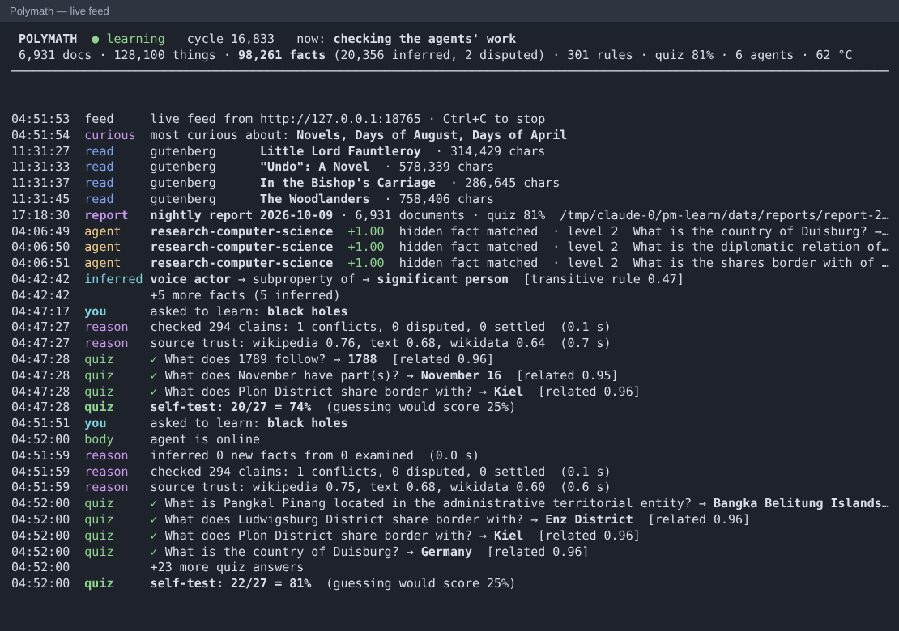

# Verification record

What was measured, on what, and what is still pending. Nothing here is estimated: every number came from
a run of the code in this repository. Unless stated otherwise, the machine was the **development container**:
x86_64, 4 vCPU, Python 3.11, through an HTTPS proxy. That is **not a Raspberry Pi**. Expect the Pi 5 to be
roughly 2–4× slower per core on the numpy-heavy parts.

## Status by phase

| phase | acceptance criterion (from the build spec) | result |
|---|---|---|
| 1 loop | 100 no-op cycles; kill -9 mid-run, restart, effects exactly once | ✅ automated (`test_core.py`), plus a real kill -9 run |
| 2 senses | ≥ 1,000 items from each source over the real internet, license on every item | ✅ see §2 |
| 3 memory | ≥ 10k docs; FTS and graph latency | ✅ synthetic 10k docs (benchmark) and real 7.4k-doc learning copy |
| 4 perception | linker precision ≥ 0.85 on 200 hand-labelled held-out sentences | ✅ 0.856, see §4 (labelled by the AI developer) |
| 5 embeddings | IVF at 1M vectors; SGNS throughput | ✅ see §5 |
| 6 reasoning | rules and inference on real data | ✅ see §6 |
| 7 drive | priorities and bandit on real data | ✅ see §6 |
| 8 evaluation | quiz accuracy above chance on real held-out facts | ✅ see §6 |
| 9 interface | CLI, cited answers, dashboard, /health semantics, live feed | ✅ automated, rendered in Chromium (§7) and in an emulated terminal (§10) |
| 10 body | thermal, disk, backups (the Minecraft player check was removed, §10) | ✅ automated with injected sensors |
| 11 deploy | systemd, live feed terminal at login, idempotent install | ✅ staged install and upgrade, `systemd-analyze verify`; **⏳ on-device boot test pending** |

## 1. Quality bar

- **Tests:** 308 automated tests pass (`pytest`), including:
  - an **offline end-to-end run** of every source through the real agent loop, against a local fixture web server;
  - staged install and uninstall;
  - a real HTTP dashboard server.
- **Coverage:** 93 % of statements and branches (`pytest --cov=polymath`).
- **Lint and types:** `ruff check`, `ruff format --check` and `mypy --strict` (package, tests and scripts) are clean.
- **Purity:**
  - `tests/test_purity.py` imports every runtime module and fails on any third-party import other than numpy.
  - The staged install's venv contains exactly `numpy`, `pip`, `polymath`.

## 2. Real-internet sample (phase 2)

`polymath sample --n 1000` against the live sources, on a fresh database. Every item has license metadata.

| source | items | with license | distinct license strings |
|---|---:|---:|---:|
| wikipedia | 1,000 | 1,000 | 1 |
| wikidata | 1,000 | 1,000 | 1 |
| openalex | 1,000 | 1,000 | 8 |
| pubmed | 1,000 | 1,000 | 1 |
| gutenberg | 1,000 | 1,000 | 1 |
| stackexchange | 1,000 | 1,000 | 2 |
| feed | 2,112 | 2,112 | 7 |
| web (crawler) | 1,000 | 1,000 | 4 |

The crawl ran at ≤ 1 request/s per host, honouring robots.txt. No job ended dead.

## 4. Entity linker on held-out real text (phase 4)

- **Sample.** 200 sentences drawn at random from **non-Wikipedia** documents in the learning copy: feeds, web
  pages, OpenAlex, PubMed, Stack Exchange, Gutenberg. The linker trains on Wikipedia anchors only, so none of
  this text was seen in training.
- **Run.** The trained model, on the real alias automaton, linked every sentence.
- **Labels.** Each of the 362 predicted links was labelled correct or incorrect **by the AI developer (Claude)**,
  not by an independent human annotator. A link counts as correct only if the article is the mention's
  referent in context. Partial spans of a longer name count as wrong; for example, "Woodland" in
  "Woodland Trust".
- **Result.** **Precision 0.856 (310 / 362).**

| source | precision |
|---|---|
| feeds | 0.920 |
| PubMed | 0.927 |
| web | 0.850 |
| Stack Exchange | 0.800 |
| OpenAlex | 0.761 |
| Gutenberg | 1 / 3 |

- **Most common error:** a word inside a longer compound or proper name ("sodium-glucose co-transporter",
  "calcium-channel blockers", "Python Software Foundation"), then generic words ("modulation", "rubric").
- **Data:** `tests/fixtures/linker_eval_200.jsonl`. A test pins the count and precision.
- **Recall** is not measured here. On held-out Wikipedia anchors the linker's own validation gives precision
  0.909 and recall 0.875.

## 5. Benchmarks

`python scripts/benchmark.py --scale full`, development container. See `the benchmark output` for the raw JSON.

| area | measurement | result |
|---|---|---|
| loop | no-op cycle overhead, 20k jobs queued | 2.949 ms (339.1 cycles/s) |
| loop | enqueue | 83,999/s |
| senses | wikitext → clean text | 156.9 pages/s (2.63 MB/s) |
| senses | bz2 block decode (own block reader) vs stdlib stream | 108.52 vs 51.78 MB/s |
| senses | HTML main-text extraction | 3,267.9 pages/s |
| senses | 7z (LZMA) decode | 1,436.5 MB/s |
| memory | index 10,000 docs → 71,147 passages | 465.9 docs/s |
| memory | full-text top-10 | p50 6.93 ms, p95 28.74 ms |
| memory | graph neighbours (top 50), 997,931 triples | p50 0.19 ms, p95 0.36 ms |
| perception | tokenize / sentence split | 4.6 / 4.5 M chars/s |
| perception | Porter stemmer | 148,613 words/s |
| perception | Aho–Corasick, 200,000 patterns | build 0.38 s; 771,371 tokens/s |
| embeddings | SGNS training | 271,176 pairs/s (dim 128) |
| embeddings | IVF, 1,000,000 vectors, 1000 lists | build 10.0 s; top-10 p50 3.56 ms, p95 7.08 ms; recall@10 0.955 |
| reasoning | forward chaining (transitive, 49,999 facts) | 349,616 inferred in 24.35 s (14,360/s) |
| reasoning | truth discovery, 50k facts | 0.72 s |
| drive | PageRank, 2,000,000 nodes / 10,000,000 edges | 1.86 s |
| drive | bandit decision | p50 0.05 ms |
| evaluation | link prediction per quiz question (fixture) | 2.6 ms |
| dashboard | /api/overview, POST /api/ask | p50 1.68 ms, 1.55 ms |
| body | guard observe | p50 0.02 ms |
| body | backup (590.4 MB DB): copy + quick_check + xz | 35.37 s (16.7 MB/s) |

The corpora are synthetic Zipf-distributed text and power-law graphs, so the sizes match the spec. The IVF data is clustered. The container was also running the live Wikidata property read, so treat these as conservative.

## 6. Learning on real data (phases 6–8)

This was run on the **learning copy**: the real phase-2 sample, reprocessed offline by the real agent loop
(`scripts/learn_offline.py --full`), plus the live Wikidata property bootstrap.

| what | result |
|---|---|
| documents read and indexed | 6,931 (443 near-duplicates set aside) |
| entities / aliases | 162,768 / 184,053 |
| sourced facts (Wikidata + infoboxes) | 76,790 (13,266 from infoboxes) |
| Wikidata property records read | 13,315 of 13,930 located; 15,098 of 15,101 predicates named |
| rules learned | 210 inverse, 13 transitive, 6 symmetric (declared by the properties), 41 domain (statistics) |
| facts inferred by forward chaining | 19,917 |
| disputed facts | 1,115 |
| entity linker, Wikipedia-anchor validation | precision 0.909, recall 0.875 |
| **self-quiz on held-out facts** | **22 / 27 = 81.5 %** (95 % Wilson CI 63–92 %), chance 25 %; P(≥ 22 by chance) ≈ 1e-9 |
| quiz answers by deciding evidence | related facts 18/19, embedding 3/4, no evidence 1/4 |
| learned evidence weights (leave-one-out on 100 visible facts) | related 0.61, embedding 0.51, text 0.02, association 0.00, graph 3.0 (prior; a hidden fact never counts directly) |
| calibration fit | log-likelihood −0.57 vs −1.39 for chance; 83 % training accuracy |

**Reading the quiz honestly.**
- **Sample size.** It is only 27 questions. The phase-2 sample holds 1,000 Wikidata items, and only held-out
  facts whose subject *and* answer have names can be asked. On the Pi, reading the full dump makes this grow
  by orders of magnitude.
- **Where the answers come from.** Most correct answers come from *other* facts the agent knows, for example
  an inverse relation or a part-of chain. That is reasoning over its own graph, not text understanding.
- **Before the fix.** The earlier run, before the property bootstrap and the link predictor, scored **12/50 =
  24 %**, which is chance. That run is kept in the database as quiz #1.

**Curiosity on real data.** Topic priorities are non-zero once PageRank precedes them. The top topics were
the Gutenberg bookshelf "Novels" (0.97), "Days of August", "Days of April" (Wikipedia date categories) and
"American Literature". Each one shows its gap × importance × novelty breakdown in `polymath why`.

**Answers on real data** (no network):
- "When was Albert Einstein born?" → 1879-03-14, citing the Wikipedia article.
- "What is the population of Brazil?" → 214,211,951, citing Wikidata.
- "What is the capital of Belgium?" → "Q239 (an entity whose name I have not read yet)". Brussels' record is
  not in the 1,000-item sample, and the agent says so instead of guessing.

## 7. Dashboard in a real browser

- **Render.** Headless Chromium (Playwright) loaded the dashboard against the real learning database, asked a
  question and looked up an entity. The result is the screenshot `docs/img/dashboard.png`.
- **Console.** No errors. The first render found a real bug: the strict CSP blocked inline `style=` attributes
  in chart legends. It was fixed by using CSSOM instead.
- **Phone width.** At 390 px there is no horizontal overflow.

## 8. What was fixed because of these runs

Real data and real browsers found bugs the fixtures did not:

- **Quiz at chance.**
  - Cause: the 1,000-item Wikidata sample contains no property records, so every predicate was a bare `P31`.
  - Fix: the property bootstrap. It read 13,930 property pages located through the multistream index, about
    4 minutes for the index and 85 minutes for the pages.
  - Also: the link predictor with learned weights.
- **Property metadata (inverse, transitive) never became facts.** The rule learner had been tested with
  hand-built triples.
- **Topic priorities all zero.** Priorities were computed before PageRank.
- **The web sample stopped at 982.** Its stop condition counted near-duplicates.
- **`/api/ask` deadlocked.** It took a non-reentrant lock twice.
- **The backup API spun forever.** It ran inside the agent's own write transaction; it now reads through a
  separate connection.
- **`/health` would report a busy agent as dead.** During a long job the database heartbeat cannot commit;
  a heartbeat pulse file now covers it.
- **An answer passage matched "francs" for "France".** A passage must now use the entity's own name.
- **Production defaults would read only 2 GB of Wikidata and have no feeds or seeds.** Fixed.

## 9. Agent society on real data

Six agents were spawned on the learning copy from plain directives:
- "research computer science"
- "predict the country of cities"
- "fact-check borders"
- "watch neural networks"
- "become an expert on Italy"
- "predict administrative regions"

They ran 40 society slices offline. Results after all the fixes below:

| agent | level | XP | verified right / wrong |
|---|---:|---:|---:|
| verify-borders | 3 | 15.0 | 15 / 2 |
| predict-country | 2 | 8.2 | 8 / 2 |
| predict-administrative-regions | 2 | 6.4 | 6 / 1 |
| research-computer-science | 2 | 5.1 | 5 / 0 |
| research-italy | 2 | 5.0 | 5 / 0 |
| watch-neural-networks | 1 | 0.0 | — (nothing new is read offline) |

- **Accuracy.** Together the agents scored **39 verified-correct against 5 wrong answers on hidden facts
  (89 %; chance is 25 %)**, with no false penalties.
- **Learned preferences.** Every agent's arms learned to prefer the action that earned verified rewards.
  Actions with nothing to do in this offline sample (reading, open predictions, disputes) learned slightly
  negative values.

**What the trials found and fixed.** Every round was run on real data until it was clean:

- **The fact-checker lost every dispute verdict.**
  - Cause 1: its verifier compared a choice with *one* hidden copy, but relations such as "shares border
    with" have several true values.
  - Cause 2, upstream in Phase 6: contradiction detection had disputed values that Wikidata itself lists
    together, such as the 23 countries of the English language and the 20 locations of World War II. A
    dispute now needs two sources that disagree, which settled **1,113 of 1,115 disputes** on the learning
    copy and restored those correct facts.
- **Open predictions guessed nonsense** ("the country of ASCII → Germany", "Chicago member of UNASUR").
  - Agents now predict a relation only for subjects whose type usually has it (≥ 30 % of the type).
  - Candidate answers come from what that type's members actually have.
  - Reflexive regularities are learned: the "country" of a country is itself, so China → China and
    Germany → Germany.
- **A watch agent reported old documents.** It now reports only what arrives after it is spawned.
- **"countries" was singularised as "countrie".** Fixed.

**What is not yet measured.**
- Open predictions pay out only when the dumps later deliver the fact, and no new data arrives in an offline
  run, so their accuracy is still unknown. The mechanism is covered by tests: confirmed → +2.0,
  contradicted → −0.8, unsettled after 60 days → expires unrewarded.
- Evolution needs 30 verified outcomes per agent before it forks or judges, so it did not trigger in a
  40-slice trial.

## 10. Live feed terminal; Minecraft player check removed

**Live feed (`polymath feed`).** Run for real against a copy of the learned database (98k facts, 6,931
documents). The real agent loop ran offline jobs: rules, inference, contradictions, source reliability, quiz,
agent steps and verification, priorities. The real dashboard served `/api/feed`. The feed ran in a pseudo-
terminal emulated at 120×36 (pyte, a dev-only tool) and was screenshotted in Chromium:

What the runs showed, and what was fixed because of it:
- **Old quiz phrasing.** The quiz's own template read "What is the capital of of Belgorod?" and "What is the
  follows of 1789?". Questions are now phrased from the predicate label: "What is Belgorod the capital of?",
  "What does 1789 follow?", "What does China share border with?". Per-predicate quiz accuracy no longer
  parses the question text back.
- **Stale header.** The quiz score and rules count in the header lagged up to 2 minutes behind the feed. Small
  tables are now read on every refresh; only full-table counts are cached (60 s).
- **Unhelpful rewards.** Agent rewards did not say what was rewarded; they now show the task (question → answer,
  document, prediction).
- **Layout.** Rule names carried internal ids ("transitive 2774 rule"), the `inferred` tag ran into the text, and
  the header did not fit 120 columns. All three are fixed.

Cost, from `scripts/benchmark.py --only feed --scale full` (1M facts, this container):

| poll | result |
|---|---|
| nothing new | p50 0.08 ms |
| after 5,000 new facts and 50 documents | p50 2.3 ms, p95 3.7 ms |
| first poll, including the full-table counts (repeated once a minute) | 0.30 s |

**Tests.** `tests/test_feed.py` (24 tests) covers:
- events since a cursor, exactly once;
- caps and "+N more" counts, and estimates for huge spans;
- unnamed entities counted, not shown;
- a cursor ahead of the data (restored backup);
- every event kind's rendering, the status header, and ASCII fallback;
- the client loop: waiting and reconnecting, status changes as feed lines, the pinned header's escape
  sequences, terminal restored on Ctrl+C and on resize;
- the HTTP source against the real dashboard, plus error answers;
- the direct source, the CLI, and a registry check that every job kind has a "now:" label.

`tests/test_deploy.py` covers:
- the launcher in lxterminal, foot, xterm and the Debian x-terminal-emulator;
- one window per login (lock), `--new` from the menu, and no terminal installed;
- the in-window prompt if the feed exits;
- a staged upgrade from the dashboard-kiosk autostart: XDG, labwc and wayfire entries are replaced, retired
  settings are commented out with a backup, and a second run is idempotent.

**Minecraft player check removed.** The Server List Ping module, the `yield` on players, the `minecraft_*`
settings and the `vitals.players` column (migration 0012, applied to the real 483 MB database) are gone. An
older configuration still loads, with a warning, and `install.sh` comments those lines out. `yield` remains for
low disk space. The CPU and memory limits stay, to keep the desktop and the feed responsive.

## 11. Pending — needs the actual Raspberry Pi 5

These cannot be done in a container and are **not** claimed:

1. `sudo ./install.sh` on Raspberry Pi OS Bookworm with an NVMe drive.
2. Reboot. The agent, the dashboard and the live feed terminal must come up with no manual step.
   Expected: lxterminal opens at login and shows "waiting" until the dashboard answers.
3. 24 h soak:
   - CPU temperature;
   - throttle and pause events;
   - memory under `MemoryMax=3G`;
   - the feed terminal staying responsive.
4. Pull the power mid-run and check that the restart resumes cleanly on the real SD card and NVMe hardware.
5. Re-run `scripts/benchmark.py` on the Pi.
